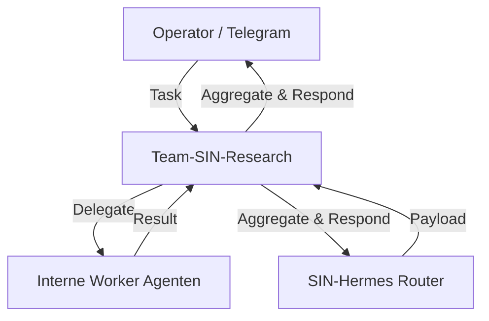

# Team-SIN-Research (Orchestrator)

Dieser Agent ist das Gehirn und der **Team Manager** für seine Domäne in der OpenSIN-AI Flotte.
Er arbeitet nach dem strikten **Hub & Spoke** Architekturmodell.

## 🏗️ Team Hierarchie



### 🛠 Unterstellte Worker-Agenten
```json
["A2A-SIN-Research A2A-SIN-Mindrift"]
```

*Verstoß gegen diese Kommunikationshierarchie ist laut PRIORITY -1 streng verboten.*
